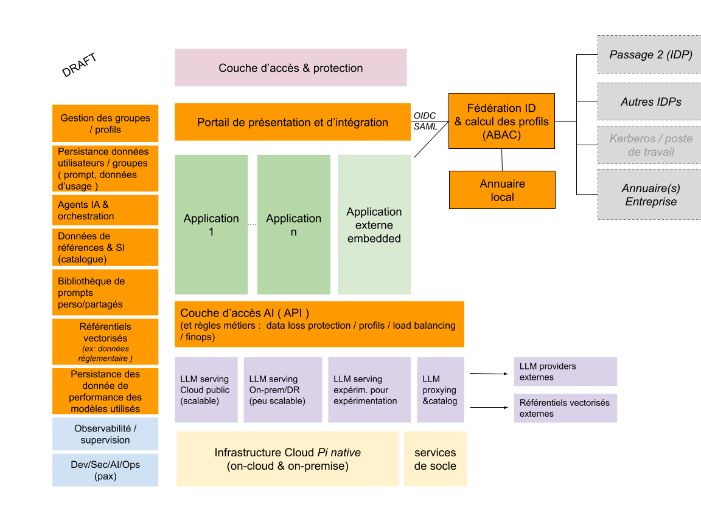
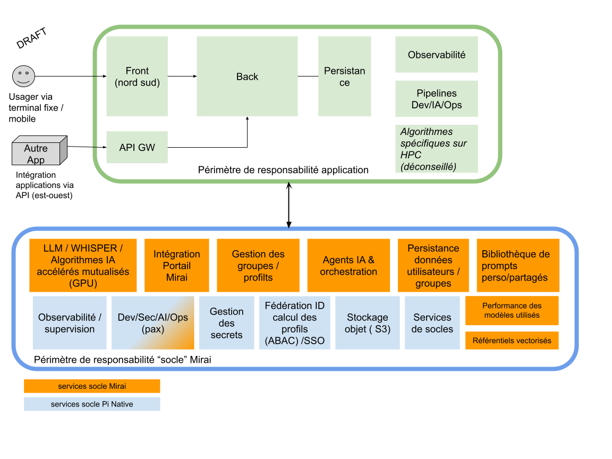
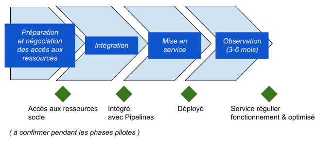

# **Cadre de Cohérence Technique (CCT) du socle d’IA et Guide d’intégration “Socle MIRAI“**
**Version : VERSION EN COURS D’ELABORATION**

**Date :** 17/03/2025

**Auteur :** Direction de la transformation numérique du Ministère de l’Intérieur.

*Cette version RFC (request for comment) vous permet de proposer vos commentaires de plusieurs manières:*
- faire des issues
- utiliser le fichier de relecture proposé
[Fichier pour commentaires](https://github.com/cloud-pi-native/cct-cloud-native/blob/main/gabarit-pour-commentaires.ods)
 et l’envoyer à : [dnum-architecture-entreprise@interieur.gouv.fr](mailto:dnum-architecture-entreprise@interieur.gouv.fr)

# Guide d'intégration
# TABLE DES MATIÈRES

1. Introduction *(cf. readme)*
2. Le contexte, les enjeux, la vision  
3. Principes généraux du socle MirAi  
4. Périmètres du document et configurations prises en compte  
5. Gestion des non-conformités, dérogations et contribution  
6. Le modèle organisationnel, de responsabilité et de collaboration autour de Mirai  
7. Préconisations générales d’architecture  
8. Modèle d’architecture logique du socle MirAi  
9. Modèle d’intégration pour les applications  
10. Description des composants du socle MirAi  
11. Enjeux liés à l’IA responsable et aux biais algorithmiques  
12. Spécificités à prendre en compte autour de la qualité et de la sécurité des applications  
13. Modèle d’intégration d’une application dans le cadre de MirAi  
14. Présentation du socle MirAi et ses évolutions pressenties  
15. Référentiel d’exigences et modalités d'usage  
16. Annexes  
- Les normes industrielles, institutionnelles applicables  
- Liens vers autres contenus utiles (informatif)  
- Glossaire  
17. Référentiel d’exigences applicables aux applications MirAi

# 2 - Le contexte, les enjeux, la vision 

**Audience : ce paragraphe s’adresse à tout acteur considérant l’usage du socle Mirai du ministère de l’intérieur pour développer des solutions basées sur l’intelligence articificielle.**

Ce document "Cadre d’intégration et de Cohérence Technique Mirai" vise à établir un cadre structuré pour l'intégration et la gestion des applications basées sur l'intelligence artificielle au sein du ministère de l’Intérieur et des Outre-Mer. Il définit les principes directeurs, les exigences techniques, et les modalités d’intégration du socle IA Mirai, garantissant ainsi la cohérence, la sécurité et la performance des solutions développées.

Objectifs principaux :

- Alignement stratégique : Assurer que les initiatives IA s'inscrivent dans une vision globale et cohérente.

- Gouvernance et responsabilité : Clarifier le rôle des différents acteurs impliqués et établir un modèle de pilotage efficace.

- Exigences techniques : Standardiser l’architecture des applications, garantir l’interopérabilité et optimiser l'utilisation des infrastructures Cloud et On-Prem.

- Sécurité et conformité : Assurer la protection des données sensibles et la conformité avec les réglementations en vigueur (RGPD, IA Act).

- Optimisation des ressources : Encourager l’éco-conception et la rationalisation des coûts, notamment en mutualisant les infrastructures et en réduisant la dette technique.

- Automatisation et efficacité opérationnelle : Intégrer des pratiques DevSecOps et MLOps pour une gestion fluide du cycle de vie des modèles IA et des applications.

- Suivi et amélioration continue : Mettre en place des dispositifs d’audit, de monitoring et de gestion des dérives algorithmiques.

Le document sert donc de référentiel technique et organisationnel pour faciliter la conception, le déploiement et l’exploitation d’applications IA dans un cadre sécurisé, évolutif et aligné sur les exigences ministérielles.

# 

# 3 - Principes généraux du socle MirAi 

**Audience : ce paragraphe s’adresse à la communauté des concepteurs et architectes solutions, le lecteur est réputé compétent et formé sur les sujets abordés .**

Ce document normalise les différents domaines associés à l’élaboration et au maintien des ressources partagées nécessaires à la mise à disposition de solutions numériques de qualité répondant au besoin.

Il favorise que l’ensemble peut-être mis en œuvre de manière cohérente avec une consommation minimisée des ressources : financière, RH et éco responsable tout en étant conforme *by design *aux référentiels de normes de l’Etat.

Il recommande ou fixe les mesures permettant d’atteindre l’objectif, tout en favorisant l’innovation, la prise en compte de l’obsolescence régulière des technologies et la manœuvre RH nécessaire (formation continue, recrutement …)

Les applications basées sur les réseaux de neurones, dont l’IA générative peuvent nécessiter l’accès à une ressource scalable de calcul haute performance (HPC) incluant des accélérateurs de traitement simultané de données en masse (GPU).[^2]
Ces ressources consomment plus de ressource énergétique qu’une infrastructure classique pour permettre l’accélération et le traitement de modèle d’IA large tel que les modèles de langage large (LLM[^3] ) pouvant atteindre des poids dépassant la centaine de gigaoctet.

Il est essentiel de bien concevoir les solutions afin d’optimiser l’accès à ces ressources coûteuses, c’est l’objectif du socle MirAi, permettre de mutualiser ce qui peut l’être, sans freiner l’innovation et accélérer la réalisation des applications en leur proposant des services communs d’accélération.

Un second aspect concerne la gestion de l’accès et la circulation de la donnée, notamment l’accès à des données de références, tel que les textes législatifs de références, les corpus de connaissances applicables au sein d’un métier ou plus simplement à des données partagées.

Un troisième aspect concerne la mise en place d’une architecture et un cadre permettant l’orchestration de service et permettant la mise en place d’agents intelligents[^4] .

Un quatrième aspect concerne la circulation de la donnée de l’usager, des groupes de travail en prenant en compte la garantie de maîtrise de l’accès et la maitrise de la fuite de donnée dans des architectures distribuées.

## Périmètres du document et configurations prises en compte

Ce document concerne le socle Mirai dans les configurations précisées ci-dessous.

- Utilisation sur les plateformes mis à disposition et managées par le ministère;

- Utilisation de ce socle dans le cas où le commun numérique est déployé sur une infrastructure non maîtrisée par le ministère.

Dans le cas où le socle est déployé en dehors du ministère, le bon usage et le respect du corpus d’exigence applicable est assuré par l’utilisateur.

**Ce cadre s’appuie et donc est 100% compatible avec le cadre Clou****d Pi Native. **

**Afin d’assurer la conformité aux exigences étatiques et faciliter les homologations des systèmes, les applications construites doivent donc respecter au delà des bonnes pratique :**

- **le corpus d’exigences associées au socle Mirai ( ce document )**

- **le corpus d’exigence de Pi Native**[^5] **dont l’usage obligatoire de la chaîne DevSecOps.**

## Gestion des non-conformités, dérogations et contribution 

L’évolution rapide des technologies cloud et IA peuvent conduire à ce que les informations ou exigences contenues dans ce document  restreignent l’innovation.

Il est également souhaité, pour éprouver le modèle, de notifier le département architecture d'entreprise du Ministère de l'intérieur au plus tôt des éventuelles impossibilités ou limitations remarquées afin de rechercher des alternatives de conception ou faire évoluer ce cadre. 

Les directions d’applications ou les organisations utilisatrices peuvent contribuer, via un échange préalable, à enrichir les fonctionnalités de l’offre ou du cadre lui-même. Sur l’offre la contribution est effectuée directement sur le repository open source de la solution via un pull request.

En cas de non-conformité aux exigences de ce document ou absence de contribution à l’offre, une demande de dérogation dûment motivée sera formulée à l’avance par la direction d’application. Seule la notification de la décision permet d’amender le besoin de conformité au cadre, temporairement ou de manière pérenne dans le cadre d’une dérogation. Dans le cadre d’une dérogation, la direction d’application prend à sa charge le surcoût complet de possession. ( formation, homologation, personnel assurant la tme, etc… )

Lors de l’utilisation du cadre et de l’offre Cloud PI Native, toute organisation souhaitant décliner ce cadre dans un document de norme inférieur pour un besoin propre est invitée à référencer la dernière version de ce document en l’état et d’éviter de dupliquer le contenu.  Dans la hiérarchie des normes, une instruction de niveau inférieur ne peut entrer en conflit ou contredire ce présent document.

## Le modèle organisationnel, de responsabilité et de collaboration autour de Mirai

L’architecture, le modèle de responsabilité et d’organisation à mettre en place est orienté pour maximiser la qualité, la sécurité, la fluidité opérationnelle et l’évolutivité du produit en  tirant parti au maximum des possibilités offertes par la technologie kubernetes, un flux de production DevSecOps et une collaboration étendue entre les acteurs. ( Ce chapitre reprend le contenu du cadre de cohérence Pi Native pour faciliter la lecture de ce document )

**Tips : prendre en compte les exigences des CCT Mirai (présent document) et Pi Native.**

**L’élargissement de la responsabilité du développeur et de l’équipe produit**

La responsabilité de l’équipe produit est élargie dans le cadre Cloud Native. Elle élabore et exploite une solution qui répond au besoin métier généralement une automatisation d’un ou plusieurs processus métiers . L’équipe s'assure de la qualité et de la disponibilité du service rendu à l’usager selon le précepte : « You build it, you run it ». L’équipe s’organise de façon  intégrée, si nécessaire avec de l’externalisation, pour couvrir l’ensemble des aspects nécessaires de la conception à l’exploitation des produits.

Le développeur, en particulier, met à disposition d’un point de vérité du code sous la forme d’un ou plusieurs dépôts de code logiciel fonctionnel et d’infrastructure. Il met en place un flux intégré et continu de production en s'appuyant sur un orchestrateur primaire DevSecOps qu’il construit et opère.

Le développeur initialise et supervise ses *pipelines* primaire et secondaire. Il intègre les étapes de vérification de sécurité génériques imposées par le ministère et spécifiques issus de la démarche d’homologation.

L’ensemble combiné des orchestrateurs primaire et secondaire soutient la fonction d’homologation et de déploiement en continu du produit numérique.

Dans le cas de la détection d’une non-qualité critique, telle une vulnérabilité critique, la progression du déploiement est bloquée, le développeur est prévenu en temps réel et doit corriger au plus tôt les défauts remontés. Cette approche permet de garantir un niveau de qualité, évite des régressions et maintient la dette technique au niveau le plus bas.

Sur le plan organisationnel le développeur met généralement en place :

- un contrôle de qualité au plus tôt, par exemple par un assistant et la revue de code ;

- l’agilité** **avec des itérations courtes de constructions et de vérification des usagers ;

- le découpage des livraisons en lot de taille de réduite ;

- la mise en place d’une culture de collaboration étendue et des pratiques intégrant la sécurité à toutes les étapes.

**La répartition des rôles et responsabilités s'établit de la manière suivante  :**

**L'équipe produit intégrée :**

- est responsable de l’application, de la qualité du code  et du bon fonctionnement de l’application pendant l’ensemble du cycle de vie de l’application. 

- est responsable de définir et d’ajuster l’infrastructure en s’appuyant sur l’élasticité du cloud.(sur la base de l’offre Cloud adaptée selon la sensibilité des données) 

- s'appuie sur les patterns applicatives et services managés mis à disposition, les magasins de charts helms et des *operators *disponibles. Il est déconseillé, par exemple, de repackager une base de données alors qu’un *operator*, un chart ou un service managé est disponible. ( simplification et systématisation du mcs )

- fournit un code de qualité exempt de défaut d'algorithmes, de qualité et de vulnérabilité ;

- met en œuvre le flux de production, logiciel local permettant d’assurer la production et la démonstration d’un code de qualité exempt d’anomalie fonctionnelle, de non-qualité et de vulnérabilité, notamment dans les librairies importées ;

- pose les normes de développement des langages utilisés ;

- met en place des pratiques DevSecOps visant un maintien de la qualité dans le temps avec les composantes suivantes ( cf outillage DevSecOps) :

- test driven development ;

- couverture de test unitaire à 100% du back-end de l’application ;

- couverture significative des tests du front de l’application ;

- analyse statique de qualité du code ;

- analyse récursive des vulnérabilités des librairies importées ;

- utilisation exclusivement d’images sources maintenues en condition de sécurité et certifiées (distribution LTS) ;

- conception des tests d’intégration en sandbox ;

- fourniture des outils nécessaires à la remontée de l'état de santé des briques applicatives destinées à fonctionner en production (healthcheck) ;

- fourniture des indicateurs nécessaires au suivi en temps réel de la qualité en condition opérationnelle de sa solution (exports prometheus) ;

- exploitation des logs remontés.

- met en place un hébergement sur une plateforme kubernetes afin d’assurer la démonstration du bon fonctionnement de l’application avec la solution qu’il préfère soit internalisée (avec un moyen de mener des démonstrations) ou sur cloud public. 

- met en œuvre l’intégration technique et organisationnelle avec la chaîne DevSecOps de l’offre Cloud Pi Native et initialise le flux logiciel  global (cf plus bas). 

- maintient un point de vérité du code logiciel ainsi que celui du code d’infrastructure. Celui-ci est accédé par la chaîne DevSecOps étatique, la sécurisation d’accès issus par token.

- est responsable de la surveillance de l’ensemble des pipelines, y compris pour celui géré côté ministère.

- met en place une intégration du flux de retour d’anomalie “shift-left” des orchestrateurs afin de permettre une correction au plus tôt des anomalies.

- effectue l’apprentissage comportemental du firewall applicatif Web (WAF) vis-à-vis de l’application dans le cadre fixé par le ministère. (anticipation avant la mise en production)

- est invité à mettre en œuvre ce pipeline au plus tôt dans le processus de réalisation ;

- met en place une gouvernance et un suivi lié à l’IA responsable et aux biais algorithmiques ;

- Met en place une organisation chargée de veiller à la qualité et la conformité réglementaire des données et de leur utilisation.

**L’équipe de développement respecte les règles suivantes permettant une qualité de code en progression et un maintien de la sécurité :**

- minimise la portion spécifique de code développés en s’appuyant sur le catalogue des services proposés. (revoir régulièrement)

- met en place une couverture de test unitaire complète du back-end  ( et fourni les moyens de vérification automatisé à la chaîne secondaire )

- mener une analyse de code systématique le plus tôt possible ( les langage et IDE modernes fournissent des fonctions de ce type )

- mener une analyse de CVE des dépendants importées et apporter des corrections.

L’équipe intégrée met en œuvre une activité continue de refactoring du code produit. Ainsi, la qualité du code ne peut pas être décroissante.

**Elle fournit les preuves** que des tests de sécurité, de qualité, de robustesse des algorithmes ont été mis en œuvre, et qu'ils n'ont pas remontés de vulnérabilités ou d'erreurs majeures. En s’appuyant notamment sur les logs des analyses des outils de la chaîne primaire. Elle fournit la preuve (ex: le document) des normes de développement et pratiques permettant de maîtriser la qualité du code produit. ( refactoring, peer review, etc.. )

Note : l’équipe s’assure qu’après le dernier déploiement stable de l’application, toutes nouvelles vulnérabilités critiques et importantes seront détectées et corrigées. En cas de non correction des anomalies dans un délai de plusieurs mois et surtout si l’application est exposée sur internet, l’hébergement de la solution pourra être suspendu pour maintenir en intégrité les données.

**Les opérateurs ****des socle Mirai et Pi native :**

Des pratiques complémentaires sont introduites :

**Le “GitOps”, **contraction de git et opération, est indispensable à la gestion des applications Cloud Native avec Kubernetes. Ce mode d’organisation du code d'infrastructure permet de maîtriser la description de l’infrastructure de production avec les mêmes pratiques de revue collaborative que celle du logiciel. Il est par exemple strictement interdit de faire des modifications «à la main » sur l’environnement de production, toute variation est supprimée, l’infrastructure réelle est strictement celle décrite par les fichiers d’infrastructure.

Le **“shift-left” **(vers la gauche du processus de développement) fait référence à la remontée le plus tôt possible vers le développeur des anomalies identifiées par la chaîne de déploiement et de vérification DevSecOps. Ce flux est notamment mis en œuvre depuis la chaîne secondaire.

Les pratique “MLOPS” liées à l’utilisation des réseaux de neurone tel que celle décrites ici :

[https://neptune.ai/blog/mlops-best-practices](https://neptune.ai/blog/mlops-best-practices)

## Préconisations générales d’architecture

Ce chapitre précise les aspects importants liés à l’usage du socle Mirai dans le cadre du ministère de l’intérieur. Il est attendu que les acteurs soient correctement formés à la solution kubernetes, à l’utilisation d’API , de l’IA et mènent une veille régulière, la technologie évoluant rapidement.

C’est le respect de ces normes qui permet à la fois d’adresser les enjeux de performance en termes de vitesse de livraison et de qualité de service, mais aussi de normaliser les applicatifs pour une meilleure évolutivité et maîtrise de la dette technique. Enfin, elles assurent une intégration fluide au sein des systèmes d’information Ministériels.

Un des principes cœurs est de laisser un certain degré de liberté au concepteur/développeur sur le fonctionnement interne de son application mais de cadrer fortement les interfaces externes.

Les schémas en pages suivantes décrivent le modèle de référence (construit incrémentalement) et le cadre d’intégration d’application.

**Modèle d’architecture logique du socle Mirai**

**Modèle d’intégration pour les applications**

**Description des composants du socle Mirai**

| Réf     | Désignation                                                                                                 | Fonction                                                                                                                                                                                                                                                                                                                                                                                                                                                                                                                                                                                                                                                                                                                                                                                                                                                                                                                            |
| ------- | ----------------------------------------------------------------------------------------------------------- | ----------------------------------------------------------------------------------------------------------------------------------------------------------------------------------------------------------------------------------------------------------------------------------------------------------------------------------------------------------------------------------------------------------------------------------------------------------------------------------------------------------------------------------------------------------------------------------------------------------------------------------------------------------------------------------------------------------------------------------------------------------------------------------------------------------------------------------------------------------------------------------------------------------------------------------- |
| APPINT  | Applications internes                                                                                       | Ensemble des applications proposées, elles fonctionnent en utilisant sur les services du socle Mirai respectant les exigences du socles. S'exécutant sur les infrastructure du ministère, déployée avec vérification de la qualité du code, en s'appuyant sur les servicess du socle Elles sont accessibles via terminal fixe ou mobile. Elles peuvent être de complexité et d'accès différents : API seul, applications intégrées ( présentation et logique métier ) ou simplement la couche de présentation consommant des services distant via API.                                                                                                                                                                                                                                                                                                                                                                     |
| APPEXT  | Applications externes                                                                                       | Ensemble des applications fournies par un tier de confiance, elles s'executent en dehors des infrastructures maitrisées par le ministère. Permet de référencer ou de présenter ces ressources, d'y inclure des informations additionnelles, bonne pratique d'usage, etc... ( ex: présention de service proposée par la Dinum)                                                                                                                                                                                                                                                                                                                                                                                                                                                                                                                                                                                                    |
| COMP001 | Couche d’accès & protection                                                                                 | Contrôle des accès et filtrage des requêtes malveillantes (ex. pare-feu, WAF).                                                                                                                                                                                                                                                                                                                                                                                                                                                                                                                                                                                                                                                                                                                                                                                                                                                      |
| COMP002 | Portail de présentation et d’intégration                                                                    | Assure la présentation et la personnalisation du contenu vis à vis de l’usager mobile et sur ordinateur fixe des services proposés au sein du portail. Cela peut concerner (construction incrémentale de la fonction) tel que la mise à disposition de liens, l’intégration des applications internes ou proposées par des fournisseurs externalisés, des articles d’information, présentation des conditions générales, contenu d’auto-formation, des messages d’informations vers les utilisateur, des zones métiers, nouveaux services en expérimentation,roadmap, etc… Le portail personnalise le contenu selon le profil et les attributs de l’usagers (ex: présentation ou non de lien pour un agent ou un groupe selon l'organisation ou la présence dans un groupe ) La mise à jour de contenu ne nécessite pas de compétences techniques aux administrateurs fonctionnels. S’appuie sur une solution de type CMS  |
| COMP003 | Fédération ID & calcul des profils (ABAC)                                                             | permet d’assurer que le portails et les applications disposent des données utiles de l’entreprise (organisation) pour autoriser l’usager, calculer automatiquement les droits, etc… les comptes sont issus des référentiels d’entreprises fournisseurs d’identité disponibles. Modèle ABAC                                                                                                                                                                                                                                                                                                                                                                                                                                                                                                                                                                                                                                          |
| COMP004 | Annuaire local                                                                                           | Cette annuaire permet la manipulation de comptes externes au référentiels d’entreprise qui sont autorisés à utiliser le système.                                                                                                                                                                                                                                                                                                                                                                                                                                                                                                                                                                                                                                                                                                                                                                                                    |
| COMP005 | Gestion des groupes / profils                                                                               | Composant permettant de mettre à disposition sous la forme d’API ces informations étendues et de gérer les groupes. ( ex: communauté de pratique transverses )                                                                                                                                                                                                                                                                                                                                                                                                                                                                                                                                                                                                                                                                                                                                                                      |
| COMP006 | Persistance données utilisateurs / groupes ( prompt, données d’usage )                                      | Ce composant as-a-service via API, est chargé de persister et circuler les données de l’usager ou de groupe et d’assurer l’accès en modalité zero trust. Ce composant porte les règles et assure la traçabilité des accès. Par exemple permet de persister un corpus de données pour un utilisateurs ou un groupe, des prompts partagés ou personnels, des données de paramétrage, etc…                                                                                                                                                                                                                                                                                                                                                                                                                                                                                                                                             |
| COMP007 | Agents IA & orchestration                                                                                   | Ce composant porte la mise à disposition et le contrôle des accès et la traçabilité des utilisations d’agents IA s’intégrant avec le legacy d’entreprise                                                                                                                                                                                                                                                                                                                                                                                                                                                                                                                                                                                                                                                                                                                                                                            |
| COMP008 | Données de références & SI (catalogue)                                                                   | Service fournissant un catalogue des corpus de données accessibles et facilite la découverte et réalisation des cas d'utilisation. Présente également les conditions d’utilisation de la donnée et les contacts éventuels. (ne fournit pas la donnée directement)                                                                                                                                                                                                                                                                                                                                                                                                                                                                                                                                                                                                                                                                   |
| COMP009 | Bibliothèque de prompts perso/partagés                                                                      | Référentiel libre d’accès de prompts éprouvé avec contribution et classement par les utilisateurs.                                                                                                                                                                                                                                                                                                                                                                                                                                                                                                                                                                                                                                                                                                                                                                                                                                  |
| COMP010 | Couche d’accès AI ( API ) (et règles métiers : data loss protection / profils / load balancing / finops) | Ce composant permet de modulariser et découpler l’architecte des applications et de porter plusieurs règles métiers telles que le load balancing (résilience) entre plusieurs fournisseurs, l’optimisation du coût des requêtes, l’orientation selon la sensibilité des données, un niveau de protection contre la fuite des données et la traçabilité des requêtes.                                                                                                                                                                                                                                                                                                                                                                                                                                                                                                                                                                |
| COMP011 | LLM serving Cloud (scalable GPU)                                                                            | Hébergement scalable pour modèles IA avec GPU.                                                                                                                                                                                                                                                                                                                                                                                                                                                                                                                                                                                                                                                                                                                                                                                                                                                                                      |
| COMP012 | LLM serving On-prem/DR (Gpu peu scalable)                                                                | Capacité de servir quelques modèles standard selon une architecture on-premise (peu élastique )                                                                                                                                                                                                                                                                                                                                                                                                                                                                                                                                                                                                                                                                                                                                                                                                                                     |
| COMP013 | LLM serving expérimentation GPU fixe                                                                        | Capacité de servir un volume nombre de modèles d’IA ouvert pour l’expérimentation et le développement. Le passage d’un modèle à l’autre peut entrainer des temps de chargement et de déchargement de modèle                                                                                                                                                                                                                                                                                                                                                                                                                                                                                                                                                                                                                                                                                                                         |
| COMP014 | Référentiels vectorisés (ex: données réglementaire )                                                     | Service fournissant directement (ou proxifiant) l’accès à des corpus de données indexées via API, tel que par exemple légifrance. Les corpus sont vectorisés et peuvent être consommée par un RAG ou une application.                                                                                                                                                                                                                                                                                                                                                                                                                                                                                                                                                                                                                                                                                                               |
| COMP015 | Données de réentrainement / tuning modèles                                                                  | Permet de persister les appréciations d’usage et de pertinence des réponses par exemple pour un tuning de modèle, des statistiques de performance ou de dérive des modèles, etc…                                                                                                                                                                                                                                                                                                                                                                                                                                                                                                                                                                                                                                                                                                                                                    |
| COMP016 | LLM proxying (catalog)                                                                                   | Permet de proxifier et suivre l’usage (ex: mener des refacturation au token) de manière transparente vers des providers externes.                                                                                                                                                                                                                                                                                                                                                                                                                                                                                                                                                                                                                                                                                                                                                                                                   |
| COMP017 | LLM providers externes                                                                                      | Fournisseur d’API IA externes tel que Mistral, Scaleway, etc…                                                                                                                                                                                                                                                                                                                                                                                                                                                                                                                                                                                                                                                                                                                                                                                                                                                                       |
| COMP018 | Observabilité / supervision                                                                                 | Service d’observabilité et d’alerte sur les applications et le socle Mirai                                                                                                                                                                                                                                                                                                                                                                                                                                                                                                                                                                                                                                                                                                                                                                                                                                                          |
| COMP019 | Dev/Sec/AI/Ops (pax)                                                                                     | Service DevSecOps permettant de mettre en place les pipeline pour les applications. Cf Cloud Pi Native.                                                                                                                                                                                                                                                                                                                                                                                                                                                                                                                                                                                                                                                                                                                                                                                                                             |
| COMP020 | Infrastructure Pi native (on-cloud & on-premise)                                                         | Offre de service de compute sous kubernetes managés par le ministère de l’Intérieur ou redéployé par l’usager sous sa responsabilité à partir du commun numérique.                                                                                                                                                                                                                                                                                                                                                                                                                                                                                                                                                                                                                                                                                                                                                                  |
| COMP021 | Services de socle                                                                                           | Permet l’envoie de messages, l’accès à des services réseaux, etc…                                                                                                                                                                                                                                                                                                                                                                                                                                                                                                                                                                                                                                                                                                                                                                                                                                                                   |

## Enjeux liés à l’IA responsable et aux biais algorithmiques

**Audience : ce paragraphe s’adresse au développeurs d’applications IA**

L’IA responsable repose sur des principes éthiques et techniques garantissant une utilisation fiable, transparente et équitable des technologies d’intelligence artificielle.

Un enjeu majeur est la gestion des **biais algorithmiques**, qui peuvent résulter de données d’entraînement déséquilibrées, de modèles mal calibrés ou de décisions opaques. 

Ces biais peuvent entraîner des discriminations involontaires et remettre en question la légitimité des décisions prises par l’IA.

Il est donc essentiel de mettre en place des mécanismes de **détection, d’évaluation et de correction des biais** dès la phase de conception des modèles. 

Cela passe par des méthodologies comme l’audit des jeux de données, l’application d’algorithmes d’équité et l’intégration de métriques de diversité et d’inclusivité.

Par ailleurs, la **traçabilité et l’explicabilité des décisions** sont fondamentales pour renforcer la confiance des utilisateurs et assurer la conformité réglementaire (IA Act, RGPD). 

L’implémentation de systèmes de **suivi des performances et des dérives** des modèles IA permet d’anticiper les évolutions des algorithmes et d’ajuster les décisions en fonction des nouvelles données. 

Enfin, une gouvernance claire, incluant des comités d’éthique et une validation humaine des résultats critiques, doit être intégrée dans le cadre de développement et de déploiement du socle technique IA pour garantir un usage responsable et aligné avec les exigences sociétales et légales.

## Spécificités à prendre en compte autour de la qualité et de la sécurité des applications

L’objectif d’ensemble est de s’assurer que le code produit est de qualité constante ou accrue, exempt de vulnérabilités algorithmiques ou importées néfastes.

Pour atteindre ces objectifs plusieurs mécanismes doivent être mis en place par l’équipe de développement intégrée :

- minimiser la portion spécifique de code développés en s’appuyant sur le catalogue de service proposé.

- mettre en place une couverture de test unitaire complète du back-end  ( et fournir les moyens de vérification automatisé à la chaîne secondaire )

- mener une analyse de code systématique le plus tôt possible ( les langage et IDE modernes fournissent des fonctions de ce type )

- mener une analyse de CVE des dépendants importées

La chaîne secondaire reconstruit les images à partir des codes sources et procède aux mêmes tests avec des outils complémentaires. L’orchestration du pipeline secondaire est gérée par l’équipe et intègre les tests de vérification issue de la démarche d’homologation de l’application qui fixe les seuils de blocage de déploiement.

Les tests typiques consistent à vérifier la qualité du code ( et la bonne couverture des tests ), et le bon fonctionnement de l’application (non régression) et le scan de vulnérabilité.

L’équipe de développement reçoit via l’interface “shift left” une notification des rapports qui doit être intégrée au flux de travail pour correction.

L’équipe intégrée est invitée à mener une activité constante de refactoring du code produit et du suivi des vulnérabilités de sécurité.La chaîne secondaire est susceptible de bloquer les déploiements si la qualité d’ensemble du code est en baisse ou que le scan fait remonter des Cves critiques. L’équipe est invitée à vérifier et prendre en compte également le résultat des scans de vulnérabilité après la dernière version stable déployée de l'application et de corriger les Cve critiques et importantes.** **

**L’équipe prend en compte que si le suivi des plans d’action n’est pas mis en oeuvre et que de surcroît des vulnérabilités critiques sont détectées depuis le dernier déploiement stable,et que l’équipe projet n’a pas pris en compte les injonctions de correction, l’application sera susceptible d’être suspendue jusqu'à la remédiation pour garantir l’intégrité et la protection de ses données**

## Modèle d’intégration d’une application dans le cadre de Mirai

La phase préparation et négociation des accès aux ressources consiste à mettre en place les convention d’usage des services du socle Mirai et Pi Native afin de fournir un premier modèle de coût et permettre à l’équipe d'architecturer efficacement l’application

Les phases d’intégration et de mise en service correspondent aux activités classiques d’un produit / projet avec par exemple la mise en place des pipelines, mesure de la qualité, mise en place de l’observabilité et de l’alerting, sélection du modèle IA et des référentiels nécessaire, etc..

La phase d’observation permet de confirmer que l’opportunité bénéfice coût est optimal, elle inclut côté projet des activités d’optimisation des modèles et d’organisation / processus.

# 4 - Présentation du socle MirAI ses évolutions pressenties

La composition de l’offre est amenée à évoluer en termes de catalogue de service selon la demande et les financements disponibles, ces évolutions permettent la diminution de la quantité de code produit par les équipes de développement et l'accélération des performances, typiquement : fonctions as services, services managés, gpu, modèles à disposition. La construction du socle Mirai est opéré selon le cadre SAFe selon un cadencement tous les 3 mois environ.

# 5 - Référentiel d’exigences et modalités d'usage

Les exigences du CCT sont classées en 2 niveaux d’exigence (périmètre du Ministère de l’Intérieur) :

- Primordial : L’exigence est impérative et traitée administrativement.

- I – Important : Exigence prise en compte pour la notation technique de la solution

Précisions sur le cas de l’exclusion administrative (périmètre du Ministère de l’Intérieur) :

- La non-conformité au cadre de norme entraîne l’exclusion administrative lors du dépouillement et la mise en œuvre des actions de remédiation du marché lors de l’exécution du marché.

- La non-conformité aux exigences d’architecture entraîne l’impossibilité d’utilisation du socle de sécurité associé à l’offre Cloud Native

Par défaut les règles du CCT s’imposent. Elles peuvent être précisées dans le cas d’un appel d'offres dans le règlement de consultation pour le dépouillement des offres et dans le CCAP pour l’exécution du marché. Une demande de dérogation est possible. ( cf paragraphe ad hoc )

## Notes
[^2]: `Mirai ( MI - r - AI ) signifie futur en japonais`
[^3]: https://fr.wikipedia.org/wiki/Single_instruction_multiple_data
[^4]: https://fr.wikipedia.org/wiki/Grand_mod%C3%A8le_de_langage
[^5]: https://cloud.google.com/discover/what-are-ai-agents
[^6]: Le cadre Cloud Pi NAtive est disponible : https://github.com/cloud-pi-native/cct-cloud-native
